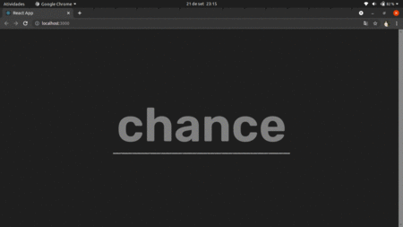

# Typing-reactjs

**Projeto desenvolvido durante a maratona js com o instrutor [Emerson Broga](https://github.com/emersonbroga).**

<h1 align="center">
    
</h1>

### Rodando o projeto
~~~bash
# Clone este repositório
$ git clone <https://github.com/Demanuel001/typing-reactjs.git>

# Acesse a pasta do projeto no terminal/cmd
$ cd typing-reactjs

# Certifique-se de ter todas as dependências instaladas.
# Execute a aplicação em modo de desenvolvimento
$ npm start

~~~